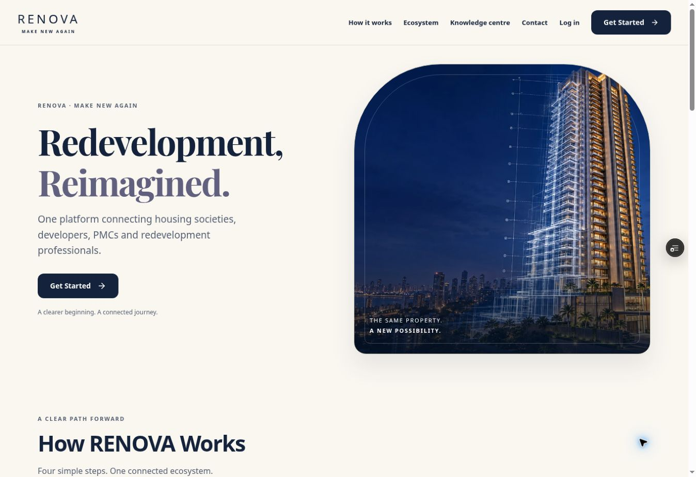
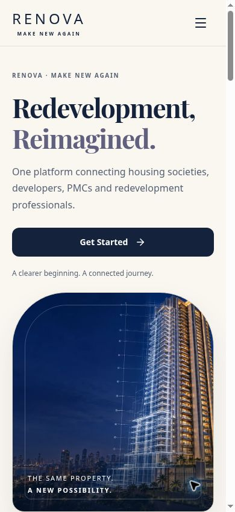
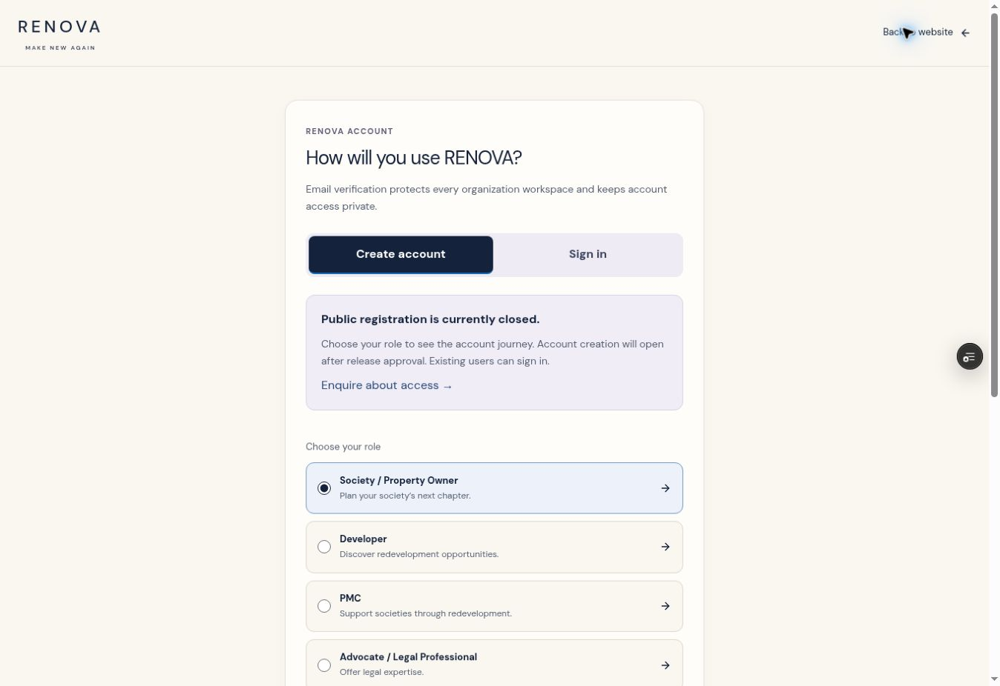
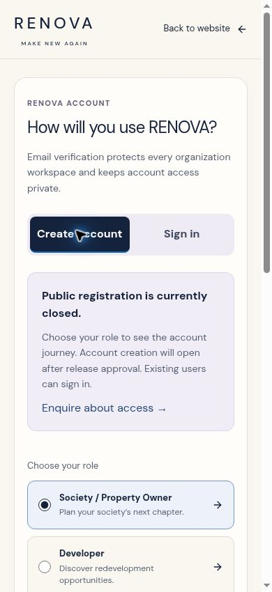
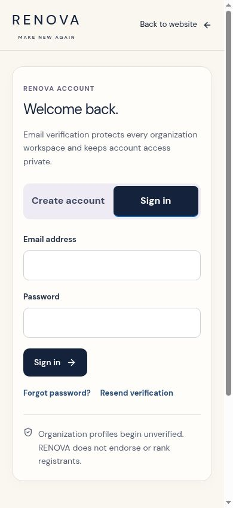
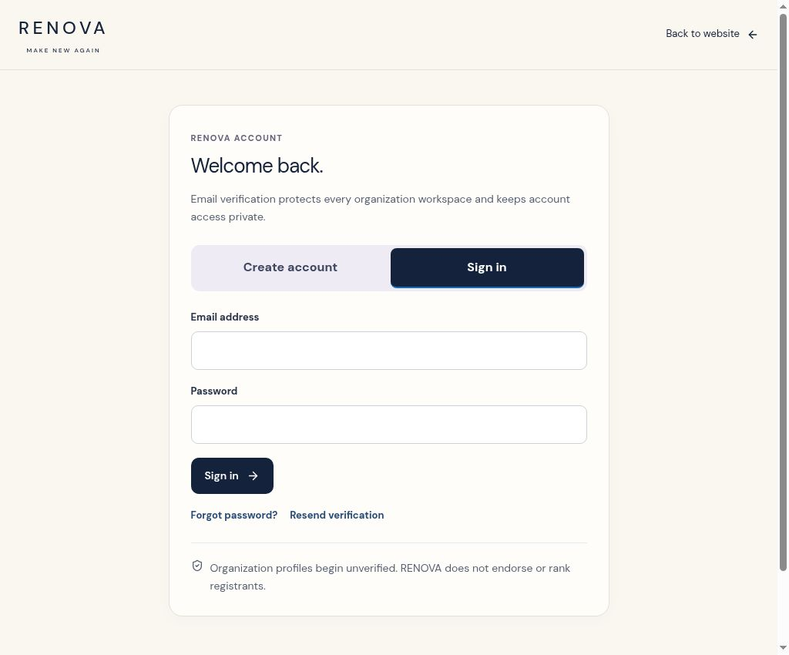

# RENOVA functional QA — PR #26

Date: 9 October 2026. Existing draft PR: https://github.com/aditidave0-ship-it/renova-redevelopment/pull/26

Code tested: a7df2878e49d1dde56fbaf79f944474013b29e78. The final documentation commit removes the temporary viewport harness and adds this evidence; it does not change application code.

Preview: https://renova-git-feat-renova-ux-consolidation-aditi-dave-s-projects.vercel.app/

Production API origin checked: https://renova-lovat-mu.vercel.app

## Release decision

**Keep PR #26 DRAFT. Do not merge or open public beta.** Public presentation checks pass after focused fixes, but authenticated browser acceptance, pending backend/schema activation and delivered verification/reset emails remain blocked. This report supersedes optimistic or historical readiness claims; a build, HTTP 200 page or health endpoint does not prove a complete user journey.

## Journey report

| Major journey | Status | Evidence | Next action / limit |
| --- | --- | --- | --- |
| Intro → homepage, muted autoplay, inline, Skip, natural completion | PASS | Local MP4 observed playing in native desktop and 390px frame. Mobile uninterrupted playback reached 104.563s, then overlay/video was removed and homepage appeared. Component identical to main; 820ms timer unchanged. | Physical iOS/Android device playback is not covered by desktop iframe testing. |
| Homepage navigation / Get Started / four explanatory steps | PASS | Real header Get Started opened role selection; each step changed its explanation; mobile menu opened and Escape closed it. | No walkthrough action is displayed before a walkthrough video exists. |
| Role selection → relevant account details | PASS | All eight roles exercised; Society/property, company, PMC, studio/practice labels followed the chosen role. ADMIN absent. | This tests UI routing, not registration completion. |
| Public registration remains CLOSED | PASS | Every selected role has disabled account creation and a visible release notice. Production POST /api/auth/register returned 503 “Registration is not open yet.” | Keep closed until separately reviewed release approval; current main API still uses two release flags, not the pending reviewed-evidence policy. |
| Login → correct authorized dashboard / session persistence | BLOCKED | Account/recovery screens render; production /api/auth/me returns 401 without credentials. No legitimate verified test session was available. | Supply existing verified controlled test accounts through secure browser sign-in, then test server role routing, refresh and cookie persistence. Do not bypass verification. |
| Logout → client signed out → old session rejected | BLOCKED | P1 helper defect fixed: successful empty 204 is accepted; regression covers 204 success and 401 failure. Four frontend tests pass. | Exercise actual signed-in logout and session invalidation against the real API; unit success is not production session evidence. |
| Society dashboard / My Society profile | BLOCKED | Legacy Society URL redirects to the canonical authenticated /platform/live sign-in gate. GET /api/profiles/me and society opportunity/interests APIs return 401 unauthenticated. | Verified Society test account; desktop/mobile profile save/reload and dashboard metrics from API. |
| Society feasibility draft → save → reload → submit → Admin review/result | BLOCKED | Production /api/societies/me/feasibility and /api/admin/feasibility return JSON 404 “Not found.” APIs are in unmerged draft PR #24. | Reconcile migration ledger, review/approve pending migrations and deploy backend; then Society/Admin acceptance with real persisted history. |
| Society opportunity create / save draft / preview / publish | BLOCKED | Existing POST /opportunities contract is retained. GET society opportunities returns 401 without a verified session. | Verified Society controlled account, labelled test opportunity and PostgreSQL persistence check. |
| Existing opportunity reload/edit/save/publish | BLOCKED | PR #24 supplies /societies/me/opportunities/:id GET/PATCH; audited main lacks those handlers. Frontend displays unavailable instead of claiming success. | Backend/schema activation after review; exercise ownership and draft persistence before publication. |
| Developer dashboard → marketplace → express interest → My Interests | BLOCKED | Developer legacy URL reaches sign-in. Real opportunity/interest consumers retained; production marketplace and unauthenticated interest POST return 401. | Verified Developer account and Society test opportunity; check duplicate-interest handling, detail fields and persistence. |
| PMC dashboard → permitted discovery/interest flow | BLOCKED | PMC legacy URL reaches sign-in; distinct PMC navigation/profile and server role retained in code. | Verified PMC account; discover the Society opportunity, express interest and verify Society receipt. |
| Society receives/reviews Developer + PMC interests | BLOCKED | Existing Society interest review/profile APIs remain connected; GET /societies/me/interests returns 401 unauthenticated. | Complete three-account browser journey; refresh/logout/login and confirm review persists. |
| Professional workspace / specialization/profile | BLOCKED | Professional access stays at sign-in; /api/organizations/me returns JSON 404. Main register accepts PROFESSIONAL but does not persist the pending specialization/profile contract. | Activate PR #24 backend/schema and use a verified Professional test account; never route it to Developer/PMC. |
| Verification / resend / forgot/reset → actual inbox → valid link | BLOCKED | Production forgot-password and resend-verification return 503 “Email delivery is not configured yet.” Invalid short verification/reset tokens returned validation 400. | Final configurable brand/origin/sender and authorized email provider setup; deliver real messages, measure time and exercise valid/expired/reused tokens. Invalid-format tests do not prove token lifecycle. |
| Authorization / organization isolation / reset-login race | BLOCKED | Unauthenticated protected API reads and interest POST return 401; 16 existing unit/policy/route tests pass. Main session/reset code lacks PR #24 credential-version protection. | Deploy reviewed backend/security foundation after schema approval; test two societies, two developers, PMC/Professional/Admin restrictions and concurrent login/reset with real controlled accounts. |
| Ecosystem search/filter → profile → claim/list enquiry | PASS | Developer filter, Arkade search/detail, Legal filter, verified-empty state and reset tested. 80 unique resolvable public slugs with HTTPS website values validated. Claim/List navigate to /contact. | These are public compiled profiles, not onboarded/verified organizations. Claim is an enquiry, not an implemented claim-approval system. External website availability was not checked for all 80 destinations. |
| Knowledge topics / FAQs / DCPR orientation UI | PASS | All five formerly decorative topics now link to their existing pages. Guides/FAQ expansion/search-empty/enquiry and orientation/detail/Escape tested. | Regulatory notes are four hardcoded API records, not daily official updates. False Current/review-date claims removed; source-backed regulatory currency remains unverified. |
| Committee guide download | BLOCKED | Button handler generates a plain-text Blob, but the browser download observer timed out and no file was captured. | Confirm download in a real browser or a supported download observer; do not mark it PASS from handler inspection. |
| Contact / enquiry validation → saved request → Admin receipt | BLOCKED | Real /api/enquiries contract, successful-reference confirmation and native required-field validation verified in UI/source. Feasibility enquiry prefilled its subject. | Submit a clearly labelled controlled enquiry and confirm PostgreSQL/Admin receipt with authorized Admin access. No successful production enquiry submission was performed in this pass. |
| Legacy/demo route consolidation | PASS | Society/Developer/PMC URLs redirect to /platform/live. Projects/preparation routes redirect to real authorized views. Canonical application has no localStorage/demo metric consumers. | Historical demo source/API fixtures remain but are not used by canonical dashboards. Do not interpret their local-storage tests as database acceptance. |
| Public responsive layouts / keyboard controls | PASS | Same-origin iframe widths 375,390,768,1024,1440: homepage, role selection, login, contact and ecosystem have no page-wide horizontal overflow. Mobile menu Escape and drawer Escape tested. | 15px scrollbar reduces document client widths; see raw measurements. Not physical device or touch/Safari testing. |
| Authenticated desktop/mobile forms, tables, modals and dashboards | BLOCKED | Each dashboard access route captured at desktop/mobile; all show the real sign-in gate, not authenticated content. | Verified role sessions plus backend activation. No mocked account/API responses were used for screenshots. |

## Focused fixes found during this pass

- **P1 — logout response mismatch:** API returns 204 with an empty body; helper previously rejected it as 502, preventing client sign-out UI after server session removal. Fixed without weakening JSON/error checks. Regression verifies empty 204 and unsuccessful 401 responses.
- **P1/P2 — stale deployment asset recovery:** an already-open homepage referenced an old lazy workspace chunk after redeploy; clicking Try again only reset React boundary state and repeated the cached import failure. It now reloads the current page only for recognized dynamic-module load errors and only after the visitor clicks. Browser reproduced the retired chunk failure, clicked Try again, and recovered to role selection.
- **P2 — Knowledge Centre navigation:** five informational cards had no route actions despite existing pages. Added links, then followed guide/FAQ/DCPR destinations.
- **P2 — unverified seeded regulatory claims:** four hardcoded /api/regulations rows exposed Current and an arbitrary reviewed/updated date. Frontend now labels these orientation notes without claiming currency; data was not replaced or represented as official current guidance.
- **P2 — orientation-card contrast:** narrow mobile QA found the general page heading color leaking onto the dark DCPR orientation card, plus a low-contrast action. Scoped white foreground and readable paragraph/action text fix it without changing the layout. Deployed 390px screenshot and computed colors confirm the heading, paragraph and action now use white foreground.
- **P2 — FAQ accessible name:** added a label to its existing search input.

No new P0 was demonstrated. This is not a comprehensive production security sign-off. P1 release blockers remain: missing backend/schema activation, reset/login credential-version deployment, full verified account/cross-organization browser acceptance, and actual verification/reset delivery.

## Exact blocker boundaries

### Authenticated browser testing

No existing verified Society, Developer, PMC, Professional or Admin test session/credentials were available in the browser or workspace. Public registration is intentionally closed. Main login requires emailVerifiedAt; recovery/verification delivery is unavailable. Previous pre-verification acceptance scripts expect register=201/session immediately and are obsolete; they were not used. No database verification flag, mock login, intercepted API response, direct credential extraction or registration bypass was introduced.

### Backend and production schema activation

PR #24 remains draft/unmerged at ae3d30d15bfe53c982098e62eee839eca640a03f. Fresh production requests prove absent feasibility and organization-profile routes (404). Health/readiness are both 200, but readyz checks existing account/opportunity/profile/enquiry columns, not PR #24 feasibility or credential-version schema. Thus readyz=ready is insufficient for this milestone.

The latest available **documented read-only SQL inspection was 7 October**, not refreshed during this QA pass. PR #24 docs/production-controlled-test-preflight.md records absent feasibility_requests, zero credential_version columns, ledger timestamps 1790664611534 / 1791224612177 / 1791227498511, and unmatched hash 17fee26d154b470f9a62ae6250575eb14cc6d70c84431c4b072049cd1320ae10. Migrations 0002–0004 are pending. Migration 0004 adds nullable organization/feasibility fields, normalizes two legacy status values and adds a constraint; the earlier absent-table observation predicts zero pre-existing rows, but MUST be re-inspected before approval/execution.

The connected Vercel tools see team aditi-dave-s-projects but return linkedProjects=[] / projects=[]. Explicit renova/api-server project lookups and preview deployment lookup return not found within this tool scope. This is an access limitation, not proof of a Vercel outage. DATABASE_URL / deployment credentials are unavailable locally. Therefore current production ledger/schema/env/logs cannot be freshly inspected from this connection.

Next: grant this integration read access to renova and api-server; read-only re-inspect schema/ledger and migration provenance; produce reviewed impact/recovery plan; obtain explicit approval before production migrations. Do not rewrite ledger entries or drop/reset data.

### Real email delivery

Fresh production forgot/reset-request and resend endpoints report EMAIL delivery unconfigured (HTTP 503). The final brand/domain/sender is undecided, and no authorized sender/provider configuration or actual delivered test inbox message is available. Pending configurable values include RENOVA_EMAIL_PROVIDER, RESEND_API_KEY, RENOVA_EMAIL_FROM, RENOVA_PRODUCT_NAME and RENOVA_APP_URL (names only; verify actual configuration contract before setup). No domain purchase, DNS changes, permanent sender configuration or authentication environment changes were made. After approved configuration, verify real inbox receipt and exercised links; unit template/token tests are insufficient.

## Interactive-element audit

| Surface/action | Actual connection | Finding |
| --- | --- | --- |
| Header/footer/hero/audience actions | Canonical routes and section anchors | Public destinations work; role links cannot grant authority. |
| Four How It Works controls | Explain corresponding step; aria-pressed state | Interactive explanatory controls, not pretend backend actions. |
| Watch How RENOVA Works | Hidden until supplied | Intentionally unavailable. |
| Account / recover / verify / reset | Real same-origin auth APIs | UI available; actual authentication/email acceptance blocked. |
| Role Create account | Disabled plus server release gate | Closed, no fake success. |
| Society/Developer/PMC profile and portfolio/services views | /profiles/me and preview API | Code connected; require authorized role. Portfolio/services edit profile fields, not separate project-upload modules. |
| Feasibility and Professional profile | PR #24 contracts | Missing API produces explicit unavailable with Contact action. |
| Opportunity drafts/marketplace/interest/review | Real authorized API contracts | No mock successes; existing draft mutations need PR #24. |
| Documents / Saved opportunities / PMC connections / Professional opportunities | Unavailable panel + enquiry | Not implemented; no fake records. |
| Dashboard metrics and completion | Existing API records/counts | Source connected, real session/browser/DB test still blocked. |
| Contact / profile claim / list organization | /api/enquiries via real form | UI and invalid-input protection tested; admin receipt blocked. |
| Public organization records | Structured 80-record source-linked seed | All PUBLIC PROFILE; neutral listings, no fabricated ratings/verification. |
| Regulatory records | Four hardcoded API orientation records | Not a current government feed; frontend no longer claims otherwise. |
| Old /api/dashboard, /api/projects, /api/professionals fixtures | Historical demonstration API | Not used by canonical authenticated workspaces; retained source is not real marketplace evidence. |

## Test evidence

- Four frontend role/API contract tests: PASS, including 204 logout and failing 401/non-JSON/API errors.
- Sixteen existing API unit/policy/route-presence tests: PASS. These are not real PostgreSQL or deployed integration tests.
- Four legacy local-storage draft tests: PASS; legacy routes are retired and these are not database-backed opportunity evidence.
- 80 public directory slugs: unique and resolve to seeded records; HTTPS website values; all public statuses. External network availability not asserted.
- Frontend and API typechecks/builds: PASS. Existing tooltip source-map diagnostic and API bundle-size warnings remain non-blocking.
- git diff --check: PASS.
- Vercel preview checks: successful frontend/API/mockup builds. API build success is not authenticated production readiness.
- Initial tsx CLI invocation failed because its IPC pipe was denied; rerun via node --import tsx passed. No sandbox relaxation needed.

No production database migrations, authentication/environment settings, paid infrastructure, intro-video edits, test account creations or successful production enquiry/opportunity/interest writes occurred during this pass.

## Screenshot evidence

Screens below are actual deployed-preview captures. Mobile captures use a 390px same-origin iframe. Temporary viewport harness is removed before final commit. Desktop homepage/roles use the native browser; access gates use 1024px frame. Dashboard images are deliberately labelled **access gates**; authenticated dashboard content remains BLOCKED.

| Screen | Desktop | Mobile |
| --- | --- | --- |
| Homepage |  |  |
| Role selection |  |  |
| Society access — BLOCKED |  |  |
| Developer access — BLOCKED |  |  |
| PMC access — BLOCKED |  |  |
| Professional access — BLOCKED |  |  |

Additional evidence: qa-evidence/production-api-probes.json, viewport-measurements.json, qa-context.json, mobile-menu-390.jpg, intro-mobile-390.jpg and workspace-asset-recovery-desktop.jpg and dcpr-contrast-after-mobile-390.jpg. The production probe body is restricted to safe status/error fields, without credentials/tokens/cookies.
