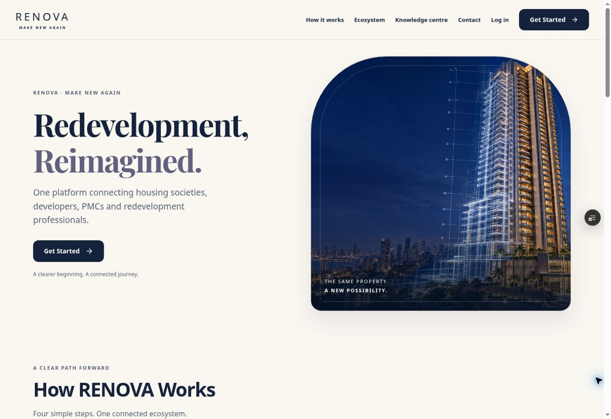

# RENOVA UX implementation and readiness review

Date: 2026-10-09. Scope: PR #26, based on main `fc5f45438f0d9cfb418054352b88792cb1d06f96`.

## Result

The homepage follows the requested eight-section order, with one clear account entry point, an interactive four-step explanation, distinct audiences, a feasibility enquiry, minimal founder information, a PostgreSQL-backed enquiry form and a concise footer. The supplied 14-screen UI reference informs the cream/navy/gold/lavender styling. The existing architectural tower asset is reused. An optional walkthrough is hidden until a source video is supplied.

The authenticated application is consolidated at `/platform/live`. Workspace navigation is determined by the authenticated server role; URL parameters select only supported views. Society, Developer, PMC and Professional experiences remain distinct. Unsupported modules have explicit unavailable states instead of fake records or fake success.

This PR changes frontend presentation and API consumers. It does not change server permissions, authentication protocols, the schema, migration history, project environment variables or production infrastructure.

## Intro preservation

`artifacts/renova/public/renova-intro.mp4` is unchanged. SHA-256:
`c69721da150630c3a4295583c2883ccd14ed51cc0891474486b301e209837745`.

`CinematicVideoIntro` is byte-for-byte identical to the component on the base branch, including the 820 ms exit timer, muted autoplay, playsInline, full-screen presentation, Skip Intro and onEnded transition. The homepage is inert and invisible while the film is present.

Browser observation confirmed the local MP4 playing, muted=true, autoplay=true, controls=false and advancing playback. Skip revealed the homepage. A fresh uninterrupted preview playback was observed advancing at 68.3 seconds of 104.6 seconds; after completion the video was removed and the homepage heading became visible. Natural completion and Skip Intro were both observed.

## Routes and visible actions

| Entry/action | Destination or behavior | Availability |
| --- | --- | --- |
| Homepage Get Started | `/platform/live?mode=start`, eight public role choices | Available; account creation closed |
| Watch How RENOVA Works | Hidden until a walkthrough asset is supplied | Intentionally unavailable |
| Header/footer navigation | Working section anchors, ecosystem, knowledge centre, contact and account | Available |
| Mobile navigation | Toggle, Escape dismissal and visible keyboard focus | Available |
| Role selection | Society, Developer, PMC, Legal, Architect, Structural, Finance/Valuation, Other | Available; ADMIN excluded |
| Register | Relevant role labels, confirmation validation, disabled submit and explicit release notice | Closed; URL/flag cannot open it |
| Login, verification, resend, forgot/reset | Existing same-origin authentication endpoints, preserved token handling and neutral recovery text | UI available; real account/email tests blocked |
| Legacy `/dashboard/society`, `/dashboard/developer`, `/dashboard/pmc` | Replace navigation to `/platform/live`; server role remains authoritative | Redirected; demo data retired from reachable routes |
| `/platform`, `/workspace`, `/project/*`, `/assessment`, `/join/*`, `/projects*` | Canonical application, with appropriate opportunities/feasibility/start view | Redirected |
| Public ecosystem | Existing source-backed records, category filters, search and profile pages | Available |
| View Profile / Claim Profile / List Organization | Profile route with slug; claim/list lead to actual enquiry form | Available |
| Society profile, Developer/PMC profiles | Existing `/profiles/me` API and public-preview contract | Code connected; authenticated QA blocked |
| Society create/save/publish opportunity | Existing `/opportunities` API, private draft and explicit preview/publish actions | Code connected; authenticated QA blocked |
| Existing draft reload/edit/publish | PR #24 `/societies/me/opportunities/:id` contracts | Unavailable state when endpoint is absent |
| Marketplace / Express Interest / My Interests | Existing authorized opportunity and interest APIs | Code connected; authenticated QA blocked |
| Society received-interest review/profile | Existing Society review and public organization profile APIs | Code connected; authenticated QA blocked |
| Professional profile | PR #24 `/organizations/me` contract, specialization retained | Unavailable when endpoint is absent |
| Feasibility draft/edit/submit/history/Admin review | PR #24 feasibility APIs, four-step form and non-linear status tracking | Unavailable with enquiry fallback until backend activation |
| Documents, saved opportunities, PMC connections, Professional opportunity discovery | Explicit feature-unavailable panel with enquiry | Intentionally unavailable |
| Settings / Logout | Actual account identity, recovery route and same-origin logout; errors remain visible | Code connected; authenticated QA blocked |
| Contact/enquiry | `/api/enquiries`; confirmation requires successful JSON response/reference | Native validation browser-tested; database submission not performed |
| Unknown URLs | Honest not-found page with homepage navigation | Available |

Old sample dashboard/project components are not exposed by the router. Unconfirmed-unused legacy source files were not deleted. The old lazy PlatformApp bundle is no longer loaded.

## Verification

| Feature | Code | Automated | Browser | Production | Status |
| --- | --- | --- | --- | --- | --- |
| Homepage/navigation/public pages | PASS | PASS | PASS | BLOCKED | PASS |
| Role selection and closed registration UI | PASS | PASS | PASS | PASS | PASS |
| Approved intro unchanged / muted playback / skip | PASS | PASS | PASS | BLOCKED | PASS |
| Natural intro completion in this pass | PASS | PASS | PASS | BLOCKED | PASS |
| Ecosystem search/filter/profile/claim navigation | PASS | PASS | PASS | BLOCKED | PASS |
| Login/recovery presentation | PASS | PASS | PASS | BLOCKED | PASS |
| Actual login, verification, reset and role routing | PASS | PASS | BLOCKED | BLOCKED | BLOCKED |
| Existing Society/Developer/PMC API consumers | PASS | PASS | BLOCKED | BLOCKED | BLOCKED |
| Draft edit, Professional profile and feasibility contracts | PASS | PASS | BLOCKED | BLOCKED | BLOCKED |
| Enquiry validation/error handling | PASS | PASS | PASS | BLOCKED | PASS |
| Actual enquiry persistence/admin receipt | PASS | PASS | BLOCKED | BLOCKED | BLOCKED |
| Authenticated responsive dashboard/form/interest QA | PASS | PASS | BLOCKED | BLOCKED | BLOCKED |

PASS in the final column for presentation does not mean production activation or beta acceptance. Automated PASS for API consumers means compilation/regression checks; it does not imply PostgreSQL integration coverage.

### Commands/results

- `pnpm install --frozen-lockfile`: PASS, lockfile unchanged.
- `pnpm run typecheck:libs`: PASS.
- Frontend typecheck and production build: PASS.
- API typecheck and production build: PASS; API code unchanged.
- Existing API test suite: 16 PASS, 0 FAIL. These are policy/unit/route-presence tests, not deployed database integration tests.
- Frontend contract tests: 3 PASS, 0 FAIL. Cover public role mapping/specializations/closed gate; same-origin cookies and confirmed JSON success; 403/404/500 and HTML fallback failures.
- `git diff --check`: PASS.
- Vercel RENOVA preview build: PASS. Skipped API/mockup deployments are not counted as successful API production verification.
- Existing tooltip source-map diagnostic and API bundle-size warning are non-blocking build warnings.

### Responsive/browser evidence

Using same-origin browser iframe viewports at **375, 390, 768, 1024 and 1440 px**, checked homepage, role selection, login, contact, ecosystem, organization profile, FAQs and About. Document scroll width matches client width. Directory category chips intentionally scroll within their own container. No page-wide horizontal overflow was observed. These are responsive browser checks, not physical iOS/Android device testing.

Checked mobile menu/Escape, Get Started, Architect selection and disabled registration, interactive How It Works, native required enquiry fields, recovery/resend screen navigation, directory Developer filter and Arkade search, profile and claim destination, FAQ expansion, correct founder and canonical legacy redirects. Fixed the dark workspace/FAQ/directory typography leak and a missing profile slug route found during QA.

Authenticated tables, modal behavior, onboarding persistence, feasibility review and cross-account journeys were not exercised without a legitimate verified test session. No email-verification bypass was created.

### Production read-only checks

The existing production `/api/healthz` returned HTTP 200. An empty register request returned HTTP 503 with `Registration is not open yet`; no account was created. This proves the registration gate was closed at check time, not that all production workflows work. No production database writes or migration operations were performed.

## Remaining release blockers

- PR #24 backend contracts and production schema are not activated on the audited main branch. Feasibility, Professional profiles and existing-draft mutation cannot be accepted end-to-end yet.
- Production migration ledger mismatch must be reconciled and pending migrations reviewed/approved before execution. This PR makes no migration changes.
- Real verification/reset delivery and link acceptance remain blocked by final brand/domain/sender configuration. No domain, DNS or permanent sender was configured.
- Full verified Society → feasibility → opportunity → Developer/PMC → interest → Society browser testing remains blocked by backend activation and controlled verified accounts.
- Authenticated desktop/mobile accessibility and layout acceptance remains blocked by a legitimate verified test session.

No new P0 issue was observed in the public UI pass. Core end-to-end release gates remain P1 blockers. Public registration remains CLOSED. Keep PR #26 draft until the outstanding authenticated/browser acceptance is completed; this report does not declare RENOVA beta-ready.

## Visual evidence

